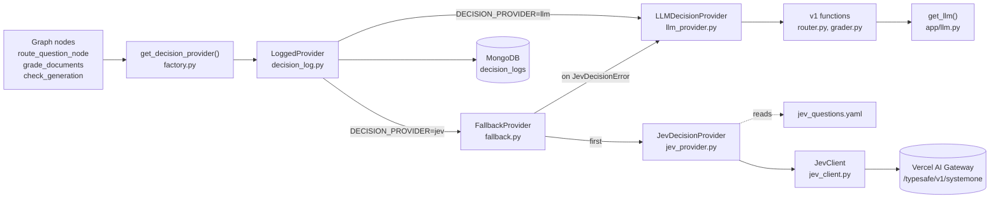
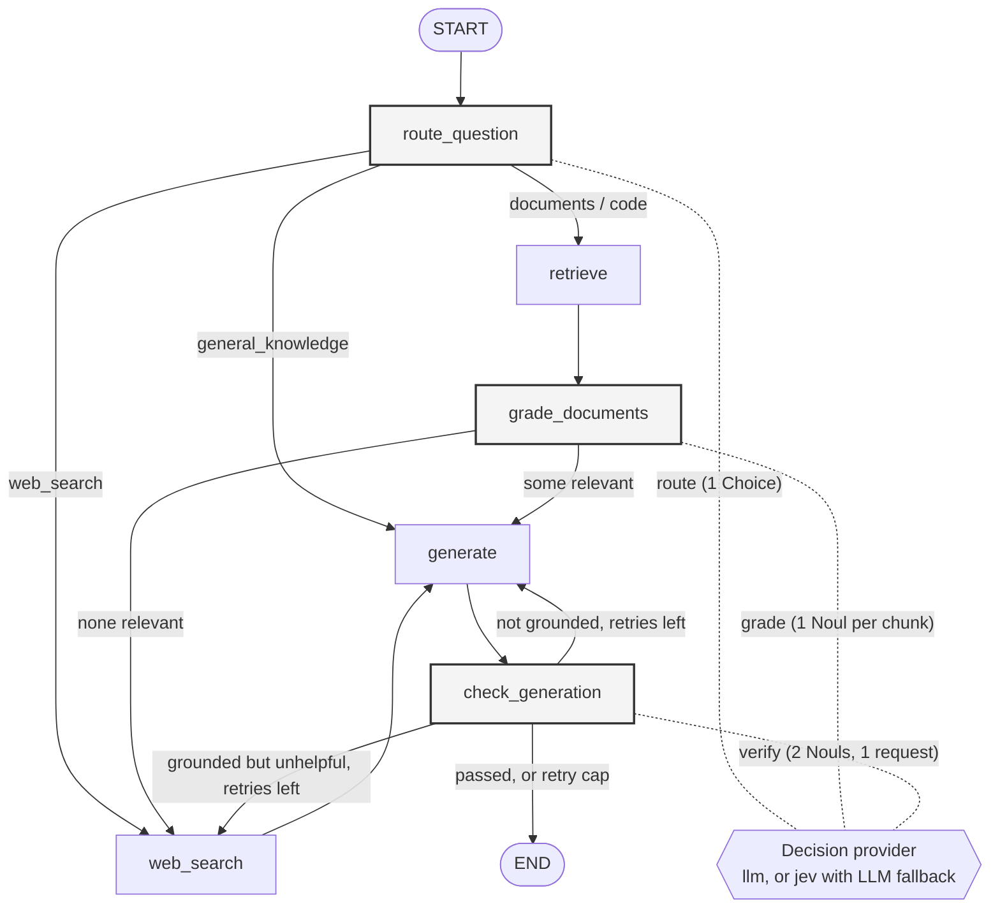
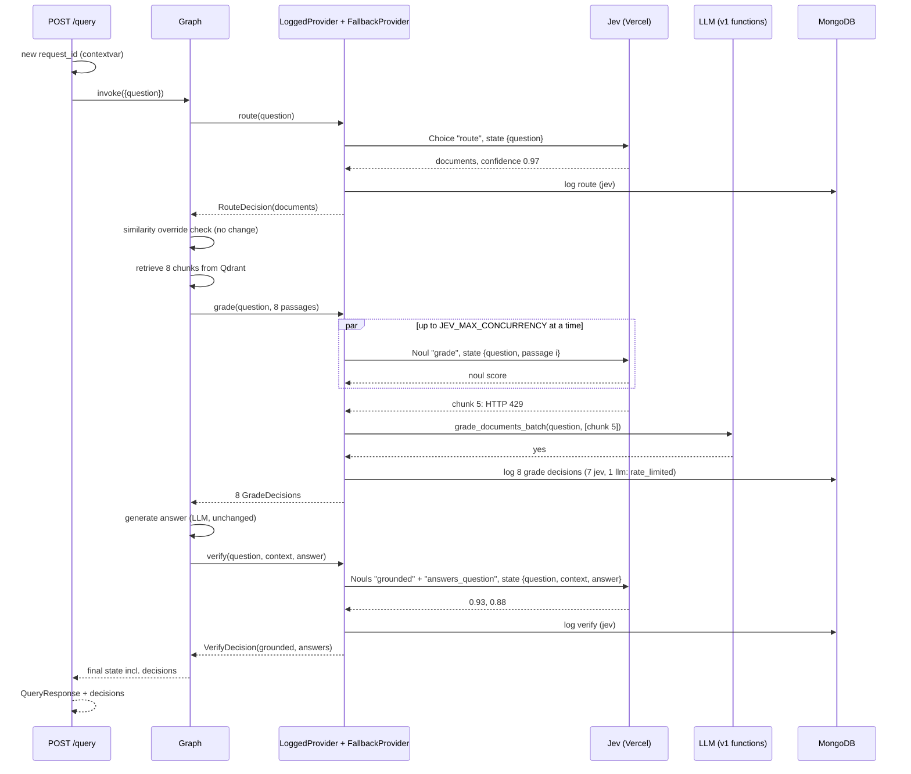

# 02. Design: Jev decision layer (v2.0)

Status: draft for review, 25 Sept 2026. Implements [01-requirements.md](01-requirements.md).

## 1. Principles

1. **Nodes ask, providers decide.** The three decision nodes call one interface. They never call Jev or an LLM directly for a decision.
2. **The LLM provider is v1.** It calls the existing v1 functions in `app/router.py` and `app/grader.py` with the same inputs, in the same order. No v1 prompt is edited.
3. **Fallback is per decision.** One failed Jev call never switches the rest of the query to the LLM.
4. **The graph does not change.** Same nodes, edges, retry cap, and state keys, plus one new key, `decisions`.
5. **User text is data.** Jev instructions and criteria come only from our YAML file. The question, passages, context, and answer only ever go inside `state`, as JSON fields.

## 2. Components



Each wrapper does one job, so each can be explained and tested on its own:

| Component | File | Job |
|---|---|---|
| Result types, interface, error | `app/decisions/base.py` | `RouteDecision`, `GradeDecision`, `VerifyDecision`, `DecisionMeta`, `DecisionProvider`, `JevDecisionError` |
| LLM provider | `app/decisions/llm_provider.py` | Calls v1 functions, times them, maps `yes`/`no` to booleans |
| Jev client | `app/decisions/jev_client.py` | One HTTP call, parses answers, usage, and cost, turns failures into `JevDecisionError` |
| Jev provider | `app/decisions/jev_provider.py` | Builds state and questions from the YAML, applies thresholds, maps to v1 routes |
| Fallback | `app/decisions/fallback.py` | Tries Jev, catches `JevDecisionError`, asks the LLM, records the reason |
| Logging | `app/decisions/decision_log.py` | Writes one Mongo document per decision; never raises |
| Factory | `app/decisions/factory.py` | Reads settings, builds and caches the stack above, fails fast on missing key |
| Question wording | `app/decisions/jev_questions.yaml` | All Jev instructions and criteria |

Why wrappers instead of one big class: logging applies in both modes, and fallback only applies in Jev mode. Stacking them keeps each behaviour in one place and lets tests use each piece alone.

Why Jev is not in `app/llm.py`: Jev is not a chat model and has no LangChain class. Keeping it under `app/decisions/` leaves CLAUDE.md rule 1 intact: LLMs are still only created in `app/llm.py`.

## 3. Where Jev plugs into the graph

The graph below is the real v1 graph. The three shaded nodes are the only ones that change, and only in how they reach a decision.



The similarity override stays inside `route_question`, after the provider returns. It runs in both modes, so the comparison is fair.

## 4. One query, step by step (Jev mode)

A documents question where one of eight chunk grades hits a rate limit:



## 5. Interface

```python
Route = Literal["documents", "code", "web_search", "general_knowledge"]

@dataclass
class DecisionMeta:
    provider: str                          # "jev" or "llm"
    latency_ms: float
    model: Optional[str] = None
    confidence: Optional[float] = None     # Jev Choice only
    probabilities: dict = field(default_factory=dict)
    input_tokens: Optional[int] = None
    output_tokens: Optional[int] = None
    cost_usd: Optional[float] = None
    market_cost_usd: Optional[float] = None
    fallback_reason: Optional[str] = None  # set when Jev was tried and the LLM decided
    jev_attempt: Optional[dict] = None     # what Jev said or why it failed, when it fell back

@dataclass
class RouteDecision:
    route: Route
    meta: DecisionMeta

@dataclass
class GradeDecision:
    relevant: bool
    score: Optional[float]                 # Jev noul; None for the LLM
    meta: DecisionMeta

@dataclass
class VerifyDecision:
    grounded: Optional[bool]               # None when there was no context
    answers_question: Optional[bool]       # None when not evaluated (LLM skips it if not grounded)
    grounded_score: Optional[float]
    answers_score: Optional[float]
    meta: DecisionMeta

class DecisionProvider(Protocol):
    def route(self, question: str) -> RouteDecision: ...
    def grade(self, question: str, passages: list[str]) -> list[GradeDecision]: ...
    def verify(self, question: str, context: str, answer: str) -> VerifyDecision: ...

class JevDecisionError(Exception):
    reason: str                            # see section 7
    detail: dict                           # latency, raw answer, status code; never the key
```

Changes from the brief's sketch, and why:

- `route()` takes only the question. v1's router uses nothing else (option A), so a `context` argument would always be empty.
- `grounded` and `answers_question` are optional, because v1 skips the grounded check without context and skips the answer check after a grounding failure. Keeping that in the types is what lets `llm` mode make exactly the same calls as v1.
- `jev_attempt` keeps what Jev said before a fallback, so we can study how often and why Jev says `unclear`.

## 6. How each decision works

### 6.1 Route

| | LLM provider | Jev provider |
|---|---|---|
| Call | `route_question(question)` | One Choice, state `{"question": ...}` |
| Output | v1 route | one of 4 routes or `unclear` |
| Unsure | not detectable | `unclear`, or `confidence < JEV_ROUTE_MIN_CONFIDENCE`: raise `JevDecisionError` |

TypeSafe computes `confidence` from how the probabilities are spread: near 1 when one option has all the probability, lower when it is split. The docs suggest treating below 0.5 as low. We start at 0.6, which is a guess to tune in Phase 5.

### 6.2 Grade

| | LLM provider | Jev provider |
|---|---|---|
| Call | `grade_documents_batch(question, passages)`, one call | One Noul per chunk, state `{"question": ..., "passage": ...}` |
| Concurrency | n/a | `ThreadPoolExecutor(max_workers=JEV_MAX_CONCURRENCY)` |
| Relevant if | `yes` | `noul >= JEV_GRADE_THRESHOLD` |
| Latency recorded | the one batch call, on each chunk's decision | each chunk's own call |

In Jev mode a chunk that fails is not retried on Jev. The fallback collects every failed chunk and grades them together in one `grade_documents_batch` call, so a burst of 429s costs one LLM call, not one per chunk.

Why one chunk per call: the brief's first design rule, because Jev's accuracy drops when the state is long or holds unrelated text. The cost is more calls per query (the baseline retrieved 8 chunks on its first questions). If Phase 5 shows too many 429s, the alternative is several Noul questions in one request, one per chunk. That puts all chunks in one state and breaks the rule, so it is a data-driven decision, not a default.

### 6.3 Verify

| | LLM provider | Jev provider |
|---|---|---|
| Grounded | `grade_hallucination(context, answer)`, only if context | Noul `grounded`, only if context |
| Answers question | `grade_answer(question, answer)`, only if grounded is not False | Noul `answers_question`, always, in the same request |
| State | n/a | `{"question": ..., "context": ..., "answer": ...}` |
| Pass | `yes` | `noul >= JEV_VERIFY_THRESHOLD` |

`check_generation` keeps v1's logic exactly: if `grounded is False`, regenerate; else if `answers_question is False`, web search; else end. Jev computes "answers the question" even when not grounded, because parallel questions cost almost nothing extra, but the node ignores it in that case, just as v1 never asks.

## 7. Fallback rules

`FallbackProvider` catches `JevDecisionError` only. Any other exception is a bug and is raised.

| `reason` | Trigger | Jev call made? |
|---|---|---|
| `state_too_large` | serialized state longer than `JEV_MAX_STATE_CHARS` | no |
| `timeout` | no response within `JEV_TIMEOUT_SECONDS` | yes |
| `network_error` | DNS or connection failure (the Phase 0 `NameResolutionError`) | yes |
| `rate_limited` | HTTP 429 | yes |
| `out_of_credit` | HTTP 402 (free monthly credit used up) | yes |
| `http_error` | any other non-2xx | yes |
| `bad_response` | invalid JSON, or an expected answer missing | yes |
| `unclear` | route Choice picked `unclear` | yes |
| `low_confidence` | route confidence below `JEV_ROUTE_MIN_CONFIDENCE` | yes |

With `JEV_FALLBACK_TO_LLM=false`, the error is raised instead, which the tests use.

`JEV_MAX_STATE_CHARS=60000` is a character guard for the reported ~32k-token state limit, assuming roughly 4 characters per token for English. It is a safety margin, not a measured conversion.

## 8. Jev client

- **Endpoint:** `POST {JEV_BASE_URL}/v1/systemone` with `JEV_BASE_URL=https://ai-gateway.vercel.sh/typesafe`. This is the TypeSafe-compatible API from the brief, verified by our Phase 0 call, and its Choice answers include `confidence`.
- **Alternative considered:** Vercel's newer generic `POST /v1/evaluate` (`boolean`/`probability` instead of `noul`, camelCase fields) recommends itself for new code and supports `providerOptions.gateway.zeroDataRetention`. It is not used for now because it is not what we verified in Phase 0. The client is the only file that knows the endpoint, so switching later touches one file.
- **Request:** `{"model": JEV_MODEL, "state": {...}, "questions": {...}}`, with `Authorization: Bearer <AI_GATEWAY_API_KEY>`. State is sent as a JSON object. If the systemone endpoint rejects objects, step 3 falls back to `json.dumps(state)`.
- **Response (from the Vercel docs):** answers are nested under `answers`; `usage` has `input_tokens` and `output_tokens`; `provider_metadata.gateway` has `cost` and `marketCost` as **strings**, parsed to floats. The response `model` is logged.
- **HTTP library:** `httpx` (already installed, now declared), sync `httpx.Client` reused across calls, created lazily.
- **Latency:** measured with `time.perf_counter()` around the HTTP call, so it includes network time from the laptop, unlike the ~186 ms gateway figure from Phase 0.
- **Secrets:** the key is only placed in the request header. Errors and logs never include headers.

`scripts/check_jev_models.py` calls `GET {JEV_BASE_URL}/v1/models` once and prints the Jev ids, so we can pin `JEV_MODEL` if a versioned id exists.

## 9. Question specs (`app/decisions/jev_questions.yaml`)

Option A: the route wording copies v1's router prompt and its `RouteQuery` field descriptions, so Jev sees the same hints the LLM sees. The grade and verify wording copies v1's grader rules, using Noul `criteria` to spell out the yes/no boundary.

```yaml
route:
  type: choice
  instructions: "Decide which datasource should answer the user question in the state."
  criteria:
    documents: "About the system manual, student login, grading, internal guidelines, or the knowledge base of uploaded documents such as PDFs and manuals"
    code: "About the codebase, code, software architecture, functions, Python, FastAPI, LangGraph, or databases"
    general_knowledge: "A greeting, general chit-chat, or a simple fact that can be answered directly without looking anything up"
    web_search: "Needs current, live, or recent information, or anything outside the domains above"
    unclear: "Empty, ambiguous, off-topic, or none of the above"

grade:
  type: noul
  instructions: "Is the passage related to the question?"
  criteria:
    true: "The passage shares keywords or meaning with the question, even if it does not fully answer it"
    false: "The passage is clearly about something unrelated to the question"

verify:
  grounded:
    type: noul
    instructions: "Is the answer supported by the context?"
    criteria:
      true: "Every factual claim in the answer appears in the context, or the answer says the context does not contain the information"
      false: "The answer makes at least one claim that the context does not support"
  answers_question:
    type: noul
    instructions: "Does the answer directly address the question?"
    criteria:
      true: "A direct, helpful response that resolves the question"
      false: "The answer dodges the question or fails to resolve it"
```

Where each rule comes from in v1:

| Jev wording | v1 source |
|---|---|
| route criteria | router system prompt plus `RouteQuery.datasource` description |
| grade `true`: "even if it does not fully answer it" | grader: "It does not need to be a stringent test" |
| grounded `true`: "or the answer says the context does not contain the information" | hallucination grader's IMPORTANT rule (the fix for the "I don't know" loop) |
| answers_question criteria | answer grader: "direct, helpful response" / "dodges the question or fails to resolve it" |

**Not built: injection screen (brief 8.4).** Web results do reach a Jev decision (they are part of the verify context), so a screen is possible. It is left as a proposal until Phase 5 shows whether it is needed.

## 10. Settings

Added to `app/config.py` and `.env.example`. Thresholds are starting guesses, not measured.

| Setting | Default | Used by |
|---|---|---|
| `APP_VERSION` | `2.0.0-dev` (set to `2.0.0` at release) | decision logs |
| `DECISION_PROVIDER` | `llm` | factory |
| `AI_GATEWAY_API_KEY` | empty | Jev client; required when `jev` |
| `JEV_BASE_URL` | `https://ai-gateway.vercel.sh/typesafe` | Jev client |
| `JEV_MODEL` | `typesafe-ai/jev` | Jev client |
| `JEV_TIMEOUT_SECONDS` | `10` | Jev client |
| `JEV_MAX_CONCURRENCY` | `3` | Jev grade |
| `JEV_ROUTE_MIN_CONFIDENCE` | `0.6` | Jev route |
| `JEV_GRADE_THRESHOLD` | `0.5` | Jev grade |
| `JEV_VERIFY_THRESHOLD` | `0.5` | Jev verify |
| `JEV_MAX_STATE_CHARS` | `60000` | Jev provider |
| `JEV_FALLBACK_TO_LLM` | `true` | factory |
| `JEV_LOG_DECISIONS` | `true` | factory |

## 11. Decision log (`decision_logs` collection)

One document per decision; grading writes one per chunk. `LoggedProvider` writes after the inner provider returns, on the request's own thread, so it can read the `request_id` contextvar set by `/query` (or by the eval script). It uses a sync `pymongo` client (already installed as part of Motor), because sync nodes cannot await Motor. Any Mongo error is logged as a warning and swallowed.

```json
{
  "timestamp": "2026-09-25T10:00:00Z",
  "app_version": "2.0.0-dev",
  "request_id": "8f0c...",
  "decision": "grade",
  "provider": "llm",
  "model": null,
  "fallback_reason": "rate_limited",
  "jev_attempt": {"latency_ms": 412.0, "status_code": 429},
  "result": "relevant",
  "confidence": null,
  "score": null,
  "probabilities": {},
  "latency_ms": 3950.2,
  "input_tokens": null,
  "output_tokens": null,
  "cost_usd": null,
  "market_cost_usd": null,
  "query_preview": "first 200 characters of the question",
  "passage_preview": "first 200 characters of the chunk (grade only)"
}
```

`result` is a route name for `route`, `relevant` or `irrelevant` for `grade`, and `{"grounded": ..., "answers_question": ...}` for `verify`, with `score` as `{"grounded": ..., "answers_question": ...}` too. The example values above are illustrative, not measured. No keys, headers, full passages, full context, or full answers are stored.

## 12. API change (`POST /query`)

`QueryResponse` gets one optional field. Every existing field keeps its meaning.

```python
class DecisionSummary(BaseModel):
    decision: str                       # route | grade | verify
    provider: str                       # jev | llm | mixed (grade only: some chunks fell back)
    result: str                         # "documents", "6/8 kept", "grounded, answers"
    confidence: Optional[float] = None
    latency_ms: float
    fallback_reason: Optional[str] = None
    fallback_count: Optional[int] = None  # grade only

class QueryResponse(BaseModel):
    ...                                 # unchanged
    decisions: Optional[List[DecisionSummary]] = None
```

The nodes build these summaries and add them to a new state key `decisions`, using the same pattern as `steps` (`state.get("decisions", []) + [...]`). A query has at most 5 entries: 1 route, at most 1 grade (retrieval runs once), and up to 3 verifies (the first pass plus 2 retries).

The `steps` text shown in the UI is not changed in either mode, so the v1 trace looks identical in `llm` mode.

## 13. UI change (`static/index.html`)

The collapsed summary line gets the provider at the end when Jev made any decision, for example:

```
documents · 6/8 docs kept · grounded · jev
```

The expanded trace lists one line per decision under the existing steps, in the same mono style:

```
route    jev   documents        0.97   210 ms
grade    jev   6/8 kept                 1 fell back to llm (rate_limited)
verify   jev   grounded, answers        380 ms
```

It stays inside the trace, the only element that uses the accent color, so the design rule in CLAUDE.md holds. The `MOCK` responses get `decisions` added so the UI can be styled without a backend.

## 14. Startup and failure behaviour

- `startup_event` in `app/main.py` calls `get_decision_provider()` once. With `DECISION_PROVIDER=jev` and no `AI_GATEWAY_API_KEY`, this raises a clear `ValueError` and the server does not start (NFR6).
- `get_decision_provider()` is cached like `get_embeddings()`. Tests and the eval script can replace it with `override_decision_provider(provider)` and reset it with `override_decision_provider(None)`.
- **Known v1 issue K1 is unchanged:** if the LLM router itself returns prose instead of JSON, the query still fails, in `llm` mode and when Jev falls back to the LLM.

## 15. Tests

All unit and integration tests run with no network: HTTP is mocked with `httpx.MockTransport` (part of httpx), and the LLM side is mocked by replacing the v1 functions. They live in `tests/unit/` and run with `python -m pytest`.

| ID | Area | Case |
|---|---|---|
| T01 | Jev client | success: answers, usage, and string costs parsed |
| T02 | Jev client | 429 gives `rate_limited` |
| T03 | Jev client | 402 gives `out_of_credit` |
| T04 | Jev client | timeout gives `timeout` |
| T05 | Jev client | connection error gives `network_error` |
| T06 | Jev client | invalid JSON, and a missing answer, give `bad_response` |
| T07 | Jev client | the API key never appears in an error message |
| T08 | Jev route | each of the 4 choices maps to its v1 route |
| T09 | Jev route | `unclear` raises `unclear` |
| T10 | Jev route | confidence below threshold raises `low_confidence` |
| T11 | Jev grade | threshold applied per chunk; order preserved under concurrency |
| T12 | Jev verify | both scores applied; no grounded question when context is empty |
| T13 | Jev provider | oversized state raises `state_too_large` with no HTTP call |
| T14 | LLM provider | calls the v1 functions with the same arguments and maps `yes`/`no` |
| T15 | LLM provider | verify skips `grade_answer` when not grounded, and skips `grade_hallucination` with no context |
| T16 | Fallback | a failed route falls back and records the reason and `jev_attempt` |
| T17 | Fallback | only failed chunks go to the LLM, in one batch call |
| T18 | Fallback | `JEV_FALLBACK_TO_LLM=false` raises |
| T19 | Logging | one document per decision; Mongo errors are swallowed; no key in documents |
| T20 | Factory | `jev` without a key fails fast |
| T21 | Graph | documents path with fake provider |
| T22 | Graph | general_knowledge path |
| T23 | Graph | web_search path, and the no-relevant-docs fallback to web |
| T24 | Graph | not grounded twice hits the retry cap and ends (rule 4) |
| T25 | API | `/query` returns `decisions`, and all v1 fields unchanged |

## 16. Evaluation

- `scripts/evaluate_decisions.py --provider llm|jev` sets the provider through `override_decision_provider` and reads latency, tokens, cost, and fallbacks from the `decisions` state. The v1-only timing wrappers are removed, since the providers now time themselves around the same calls.
- `--shadow-llm` (eval only) wraps the Jev stack in a shadow provider: after every Jev grade and verify that Jev answered itself, it asks the LLM the same question on the same input and records agreement. It never changes the graph's path.
- Runs: one `llm` run (the NFR1 regression check) and one `jev --shadow-llm` run, each with a delay between questions and `--resume` if interrupted.
- `scripts/compare_results.py` reads `v1_baseline.json` and both runs, and writes `results/eval/comparison.md` plus PNG charts (matplotlib): route accuracy per category, latency per decision (median and p95), fallback reasons, and Jev cost.

## 17. Trade-offs to revisit with data

| Choice | Alternative | Revisit when |
|---|---|---|
| One Noul per chunk | Several chunk Nouls in one request | Phase 5 shows many 429s or slow grading |
| `/typesafe/v1/systemone` | `/v1/evaluate` with zero data retention | before release, if data retention matters for the course PDFs |
| Route confidence 0.6 | Tuned value | Phase 5 fallback rate for `low_confidence` |
| Sync nodes with a thread pool | Async graph | only if the API becomes multi-user (out of scope) |
