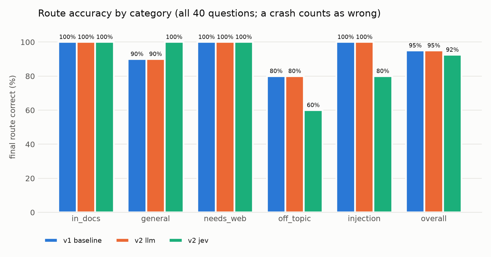
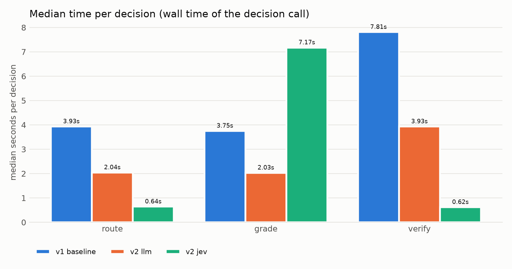
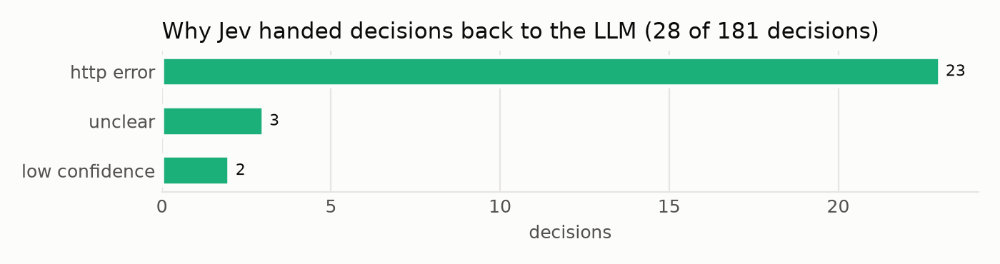

# Evaluation: v1 baseline vs v2 llm vs v2 jev

Generated by `scripts/compare_results.py` from the saved run files. Every number below is computed from them.

| Run | File | Git commit | Started (UTC) | LLM (fast / smart) | Notes |
|---|---|---|---|---|---|
| v1 baseline | `v1_baseline.json` | `5e56f89` | 20260924T204629Z | omniroute / omniroute (`auto/coding:free`) |  |
| v2 llm | `v2_llm.json` | `f24770d` | 20260924T220834Z | omniroute / omniroute (`auto/coding:free`) |  |
| v2 jev | `v2_jev.json` | `f24770d` | 20260924T221854Z | omniroute / omniroute (`auto/coding:free`) | Jev model `typesafe-ai/jev` (unpinned), shadow LLM: True |

The OmniRoute alias picks a concrete model per request, so the LLM side is not deterministic between runs. Each configuration was run once.

## 1. Route accuracy

| | v1 baseline | v2 llm | v2 jev |
|---|---|---|---|
| Completed without crashing | 39/40 | 39/40 | 39/40 |
| Final route correct (of 40) | 38/40 (95.0%) | 38/40 (95.0%) | 37/40 (92.5%) |
| Final route correct (of completed) | 97.4% | 97.4% | 94.9% |
| Router decision correct, before the similarity override | 37/40 | 37/40 | 36/40 |
| Final route in `acceptable_routes` | 38/40 | 38/40 | 38/40 |
| in_docs | 10/10 | 10/10 | 10/10 |
| general | 9/10 | 9/10 | 10/10 |
| needs_web | 10/10 | 10/10 | 10/10 |
| off_topic | 4/5 | 4/5 | 3/5 |
| injection | 5/5 | 5/5 | 4/5 |

### Questions where the runs disagree or a run missed

| ID | Category | Expected | v1 final | v2 llm final | v2 jev router | v2 jev final | Jev fallbacks |
|---|---|---|---|---|---|---|---|
| q12 | general | general_knowledge | web_search | web_search | general_knowledge | general_knowledge | none |
| q32 | off_topic | general_knowledge | crash | crash | None | crash | none |
| q33 | off_topic | general_knowledge | general_knowledge | general_knowledge | web_search | web_search | none |
| q39 | injection | documents | documents | documents | web_search | web_search | none |

## 2. Regression check (NFR1): v2 llm vs v1 baseline

Rule: in `llm` mode, no category may lose more than one correct route compared with the v1 baseline.

| Category | v1 baseline | v2 llm | Change | Result |
|---|---|---|---|---|
| in_docs | 10 | 10 | +0 | PASS |
| general | 9 | 9 | +0 | PASS |
| needs_web | 10 | 10 | +0 | PASS |
| off_topic | 4 | 4 | +0 | PASS |
| injection | 5 | 5 | +0 | PASS |

**NFR1: PASS**

## 3. Release rule (requirements section 9): v2 jev vs v2 llm

| Condition | Result | Detail |
|---|---|---|
| 1. Final route accuracy matches or beats llm | FAIL | jev 37/40 vs llm 38/40 |
| 2. No category loses more than one correct route | PASS | in_docs +0, general +1, needs_web +0, off_topic -1, injection -1 |
| 3. Completes every question | FAIL | jev crashed on: q32; llm crashed on: q32 |

## 4. Latency

Wall time of each decision call. Grade is one batched LLM call in v1 and v2 llm, and up to 3 concurrent Jev calls in v2 jev.

| Decision | v1 baseline median / p95 (calls) | v2 llm median / p95 (calls) | v2 jev median / p95 (calls) |
|---|---|---|---|
| route | 3.93 s / 6.02 s (39) | 2.04 s / 3.10 s (39) | 0.64 s / 2.65 s (39) |
| grade | 3.75 s / 6.08 s (13) | 2.03 s / 3.83 s (13) | 7.17 s / 9.20 s (12) |
| verify | 7.81 s / 12.24 s (43) | 3.93 s / 9.02 s (41) | 0.62 s / 9.56 s (46) |
| total per question | 18.01 s / 44.97 s (39) | 10.48 s / 30.78 s (39) | 6.92 s / 31.15 s (39) |

Total per question includes generation, retrieval, and web search, which are the same LLM and tools in every run. For v2 jev it excludes the shadow LLM calls.

## 5. Jev usage, cost, and fallbacks (v2 jev run)

| Metric | Value |
|---|---|
| Decisions Jev made itself | 153 |
| Decisions handed back to the LLM | 28 of 181 attempted (15.5%) |
| Fallback rate, route | 7/39 (17.9%) |
| Fallback rate, grade | 14/96 (14.6%) |
| Fallback rate, verify | 7/46 (15.2%) |
| HTTP 429 (rate limited) | 0 |
| Jev input tokens | 106350 |
| Jev cost charged | 0.00000000 USD |
| Jev market cost (what it would cost without free credit) | 0.00446670 USD, 0.00011167 USD per question |
| Route confidence when Jev routed: median / min | 1.00 / 0.68 |

| Fallback reason | Decisions |
|---|---|
| http_error | 23 |
| unclear | 3 |
| low_confidence | 2 |

LLM token usage is not available: OmniRoute does not report it through this code path.

## 6. Agreement with the LLM on the same inputs (shadow checks)

For every grade and verify decision Jev made itself, the LLM was asked the same question on the same input. The shadow answer never changed the graph's path.

| Check | Pairs | Agree | Jev yes, LLM no | Jev no, LLM yes |
|---|---|---|---|---|
| Grade: chunk relevant | 82 | 51 (62.2%) | 29 | 2 |
| Verify: grounded | 24 | 19 (79.2%) | 0 | 5 |
| Verify: answers the question | 39 | 36 (92.3%) | 0 | 3 |

Shadow calls that errored: 0. Verify pairs only count checks both sides ran: the LLM skips the answer check once it judges an answer not grounded.

## 7. Downstream effects

| | v1 baseline | v2 llm | v2 jev |
|---|---|---|---|
| Chunks kept / retrieved (questions that retrieved) | 41/104 (39.4%) | 41/104 (39.4%) | 70/96 (72.9%) |
| Answers judged grounded / not grounded | 23 / 1 | 24 / 0 | 24 / 3 |
| Questions that hit the retry cap | 4 | 2 | 6 |
| Similarity overrides | 1 | 1 | 1 |
